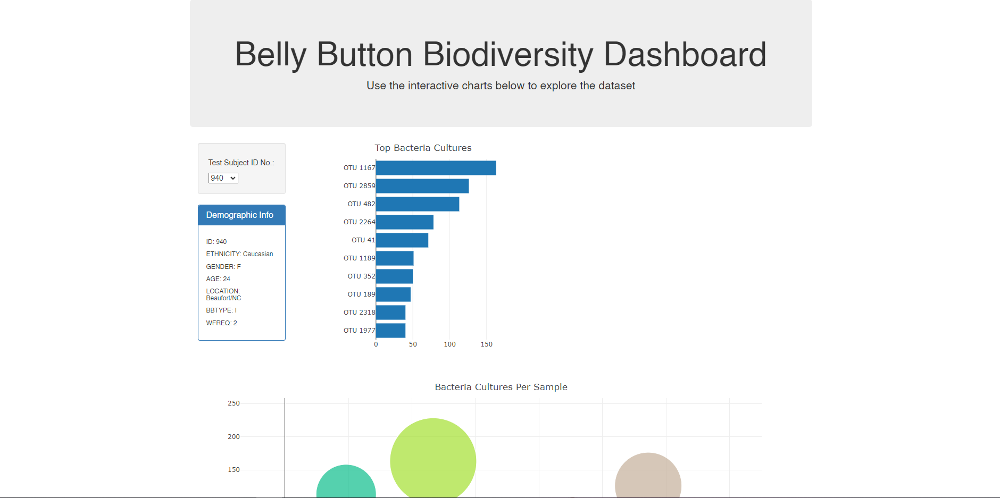
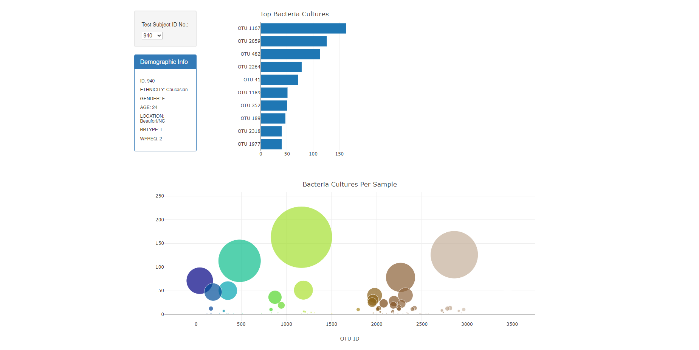
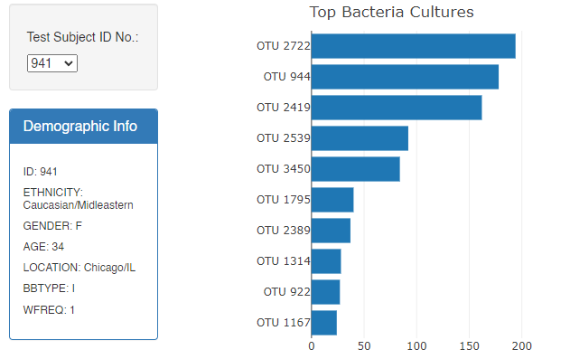

# plotly-visuals | Belly Button Biodiversity 

The dataset and subsequent plotly visuals reveal that a small handful of microbial species (also called operational taxonomic units, or OTUs, in the study) were present in more than 70% of people, while the rest were relatively rare.

The goal of this repository is to demonstrate a working knowledge of plotly (JavaScript). 

  

## Repository Structure

JavaScript Plots | [plotly.js](static/js/plotly.js)

HTML Homepage | [index.html](index.html)

## Setup 

1. Clone repository
2. run index.html in a live sever (I used vs code extentsion 'LiveServer' ExtensionID: ritwickdey.liveserver)

This project requires index.html be run on a server, otherwise data cannot be collected from the .json file and built into plots. In the future this project has the potential to be built into a Flask app and run that way. 

## Homepage

## Bubble Plot

## Demographic Metadata

